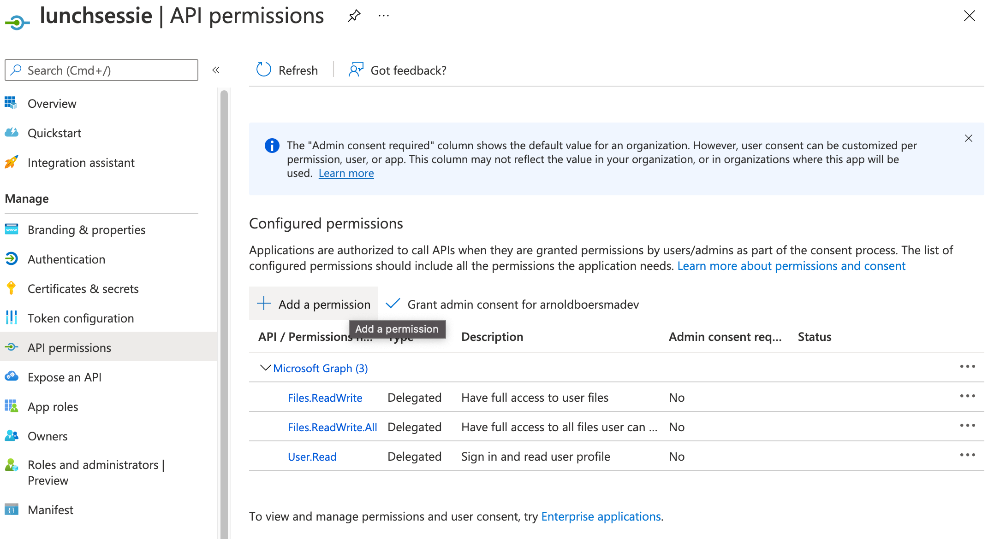

# vitas-lunch

## Create App registration
Create app registration and use clientId and TenantId in application settings in Program.cs.

### Platform configurations

### API Permissions

## Get groupId
GroupId is the Teams GroupId for the team where the documents are stored.

Get group id:
- `get link to team` link

- look for groupId in the querystring
